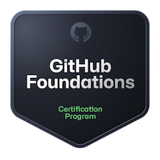

Dette var en eksamen og sertifisering som jeg verken hadde lyst eller plan om å ta da den dukket opp høsten 2023. På det tidspunktet var jeg godt fornøyd med å ha fått en grunnleggende forståelse [git](https://git-scm.com/book/en/v2/Getting-Started-What-is-Git%3F) etter gjennomføringen av [Terraform Bootcamp](https://www.linkedin.com/feed/update/urn:li:activity:7119722438279495680/) med [Andrew Brown](https://www.linkedin.com/in/andrew-wc-brown/).
Min bruk av [git](https://git-scm.com/book/en/v2/Getting-Started-What-is-Git%3F) og [GitHub](https://github.com) er sporadisk og brukes stort sett til private repositories når jeg av og til skriver [PowerShell](https://learn.microsoft.com/en-us/powershell/scripting/overview?view=powershell-7.4) script. Jeg følte allerede at jeg hadde grei kontroll på det tidspunktet.

For en drøy måned siden, fikk jeg det for meg at jeg ville prøve ut [GitHub Pages](https://pages.github.com/) og blogge innimellom. Selve oppsettet av web siden er enkel - GitHub gir god veiledning for å sette opp siden. Nå har jeg belaget meg på at innleggene som blir skrevet her, skal være i Markdown, og jeg ønsker å gjøre dette på enklest mulig måte. Det er mulig å benytte [Jekyll](https://jekyllrb.com/) til dette, og det er mest sannsynlig at jeg ender opp med den løsningen i fremtiden. Jeg ser derfor på dette som en gulrot for å lære litt om [GitHub Actions](https://docs.github.com/actions/learn-github-actions/understanding-github-actions) (og CI/CD) for å publisere innlegg.

Omtrent i samme tidsrom drev jeg på med noen script og følte et behov for å benytte git og GitHub. Det viste seg imidlertid ganske fort at jeg hadde glemt mye av den grunnleggende bruken. Jeg gjorde en del feil med commits og pull requests, noe som fort ble irriterende.

Dette medførte at jeg begynte å søke etter informasjon. Jeg fant ganske fort [Pass the GitHub Foundations Certification](https://www.freecodecamp.org/news/pass-the-github-foundations-certification-course/) på [FreeCodeCamp](https://www.freecodecamp.org) med Andrew Brown fra [ExamPro](https://www.exampro.co). Jeg liker måten Andrew Brown formidler kunnskap på. Til tider kan det virke litt rotete, men samtidig så viser han hvordan han løser utfordringer som gjerne oppstår når man jobber med denne typen ting.

I utgangspunktet hadde jeg bare tenkt å gå igjennom Git- og GitHub Actions-delene fra dette kurset, men en kveld dukket det opp på LinkedIn at GitHub gav bort gratis kuponger for [GitHub Foundations](https://github.com/LadyKerr/github-certification-guide/blob/main/study-guides/gh-foundations.md). Ville det det være verdt å se hele den  ni timer lange videoen? Mye av innholdet i sertifisering vil jeg sannsynligvis aldri få bruk for ettersom jeg ikke ser for meg at koding vil bli en del a hverdagen min.

Etter mye stirring i skjermen logget jeg meg på eksamensportalen og 50 minutter senere hadde jeg besvart de 75 spørsmålene (multiple choice, true/false og scenario baserte), men det er bare 60 spørsmål som blir vurdert. Jeg gikk ut derfra med [bestått](https://www.credly.com/badges/c79edea5-1c62-411f-a962-5efdf167d708).